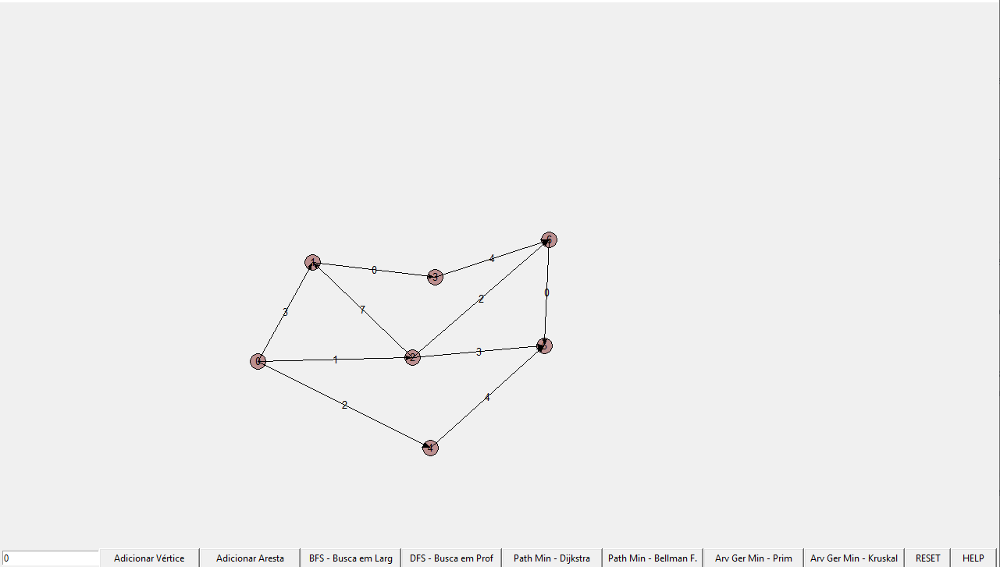
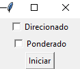
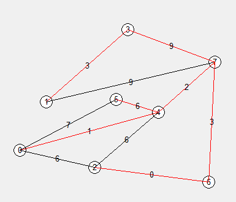
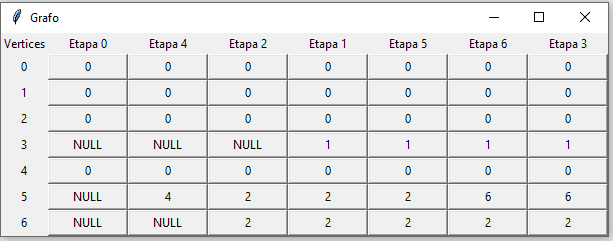

# Cadeira Algoritmos 2019.2
Códigos da cadeira de algorítmos.

- Lista 1

> Cronometro: Objeto para a compreensão de POO, do qual armazena informação e interage com o usuário através de métodos como ligar, desligar, parar e zerar.

- Lista 2

> Util: Uma lista duplamente encadeada que simula a lista do Python, com seus respectivos métodos como o pop, index, insert. Uma fila e pilha além de um ponteiro para iteração.

- Lista 3

> Arvore: Uma estrutura de dados em forma de árvore, da com seus respectivos métodos como exibição em pós-ordem, pré-ordem, do sucessor e antecessor. Uma árvore AVL que pode balancear as demais.

> Hash e aleatorio: Uma tentativa de criação de uma tabela Hash e um gerador de "pessoas".

- Lista 4

> Grafo: Uma estrutura de dados em forma de grafo com seus respectivos métodos, como a exibição em matriz ou lista de adjacências, e a busca em largura (BFS) ou profundadade (DFS).

- Projeto

> Lê vários arquivos do TSE, nos quais o script guarda todos os candidatos em uma estrutura de uma lista encadeada, e ordena-os conforme alguns parâmetros, de uma forma mais eficiente possível.

- Treinando

> Um programinha simples para os novatos da cadeira de algorítmos, onde tenta recriar de forma visual os algorítmos de busca, árvore geradora, caminho mínimo em grafos: BFS, DFS, Kruskal, Prim, Dijkstra, Bellman F.

## Contribuidores e contato

José Danilo, Centro de Informática, UFPE

Algum algorítmo pode estar errado, entre em contato: jdsc@cin.ufpe.br